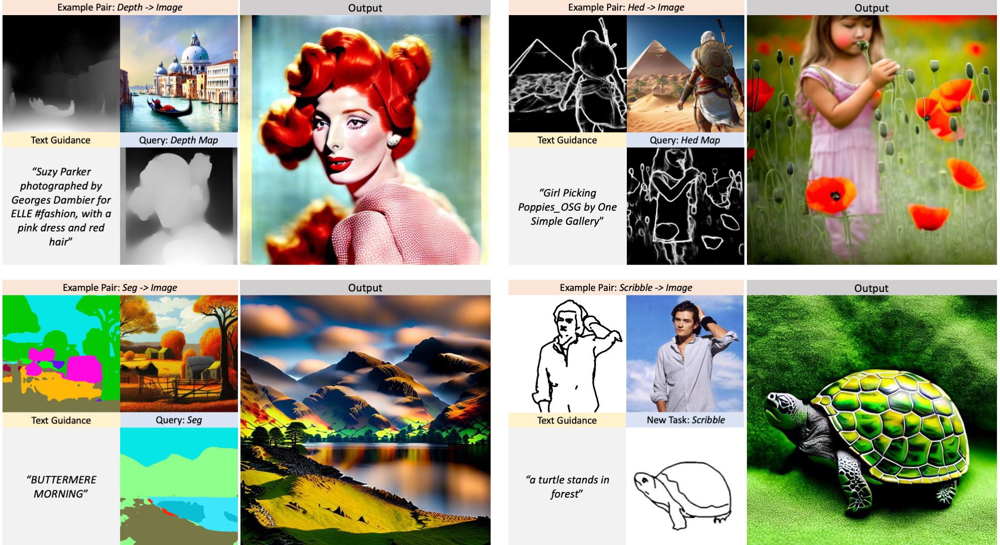
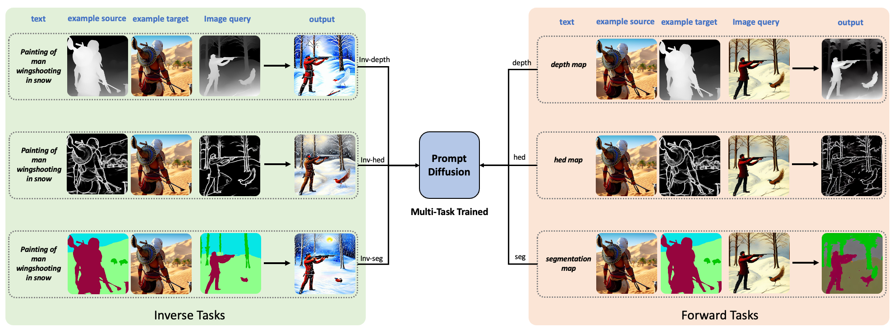
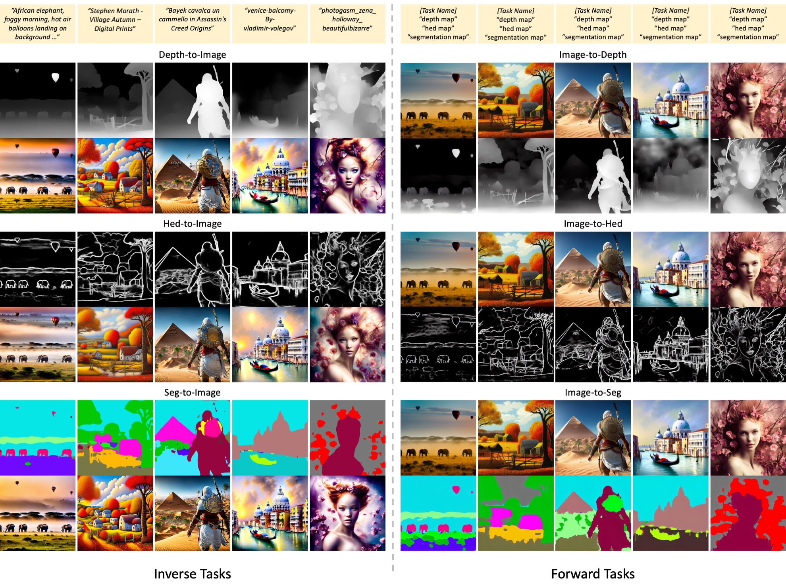
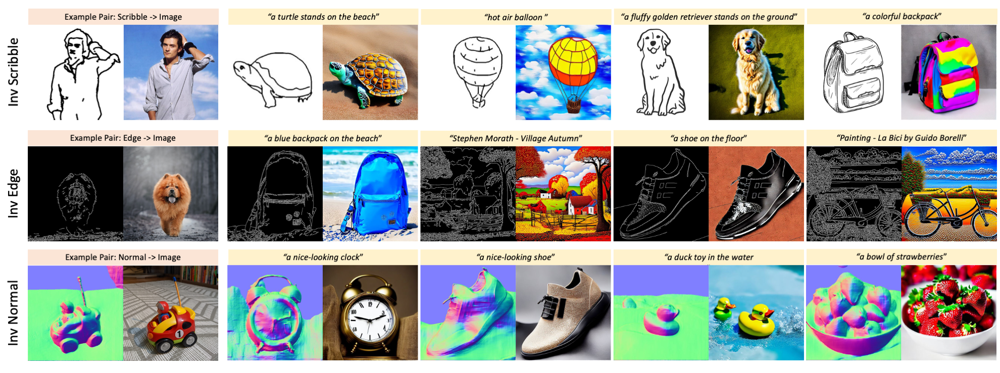
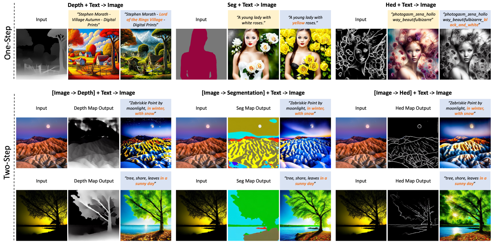

## Prompt-Diffusion: In-Context Learning Unlocked for Diffusion Models
### [Project Page](https://zhendong-wang.github.io/prompt-diffusion.github.io/) | [Paper](https://arxiv.org/abs/2305.01115)


**In-Context Learning Unlocked for Diffusion Models**<br>
Zhendong Wang, Yifan Jiang, Yadong Lu, Yelong Shen, Pengcheng He, Weizhu Chen, Zhangyang Wang and Mingyuan Zhou <br>

[//]: # (https://arxiv.org/abs/2206.02262 <br>)

Abstract: *We present Prompt Diffusion, a framework for enabling in-context learning in diffusion-based generative models. 
Given a pair of task-specific example images, such as depth from/to image and scribble from/to image, and a text guidance,
our model automatically understands the underlying task and performs the same task on a new query image following the text guidance.
To achieve this, we propose a vision-language prompt that can model a wide range of vision-language tasks and a diffusion model that takes it as input.
The diffusion model is trained jointly on six different tasks using these prompts. 
The resulting Prompt Diffusion model becomes the first diffusion-based vision-language foundation model capable of in-context learning. 
It demonstrates high-quality in-context generation for the trained tasks and effectively generalizes to new, unseen vision tasks using their respective prompts.
Our model also shows compelling text-guided image editing results. Our framework aims to facilitate research into in-context learning for computer vision, with code publicly available here.*



## ToDos
- [x] Release pretrained models
- [x] Release play-around codes


## Results
### Multi-Task Learning



### Generalization to New Tasks



### Image Editing Ability



## Train Prompt Diffusion

### Prepare Dataset

We use the public dataset proposed by [InstructPix2Pix](https://github.com/timothybrooks/instruct-pix2pix) as our base dataset, 
which consists of around 310k image-caption pairs. Furthermore, we apply the [ControlNet](https://github.com/lllyasviel/ControlNet) annotators
to collect image conditions such as HED/Depth/Segmentation maps of images. The code for collecting image conditions is provided in `annotate_data.py`. 

### Training

Training a Prompt Diffusion is as easy as follows, 

```.bash
python tool_add_control.py 'path to your stable diffusion checkpoint, e.g., /.../v1-5-pruned-emaonly.ckpt' ./models/control_sd15_ini.ckpt

python train.py --name 'experiment name' --gpus=8 --num_nodes=1 \
       --logdir 'your logdir path' \
       --data_config './models/dataset.yaml' --base './models/cldm_v15.yaml' \
       --sd_locked
```

We also provide the job script in `scripts/train_v1-5.sh` for an easy run. 

## Run Prompt Diffusion from our checkpoints

We will update the code for playing Prompt Diffusion and the model checkpoints soon. 

## More Examples


## Citation


```
@article{wang2023promptdiffusion,
  title     = {In-Context Learning Unlocked for Diffusion Models},
  author    = {Wang, Zhendong and Jiang, Yifan and Lu, Yadong and Shen, Yelong and He, Pengcheng and Chen, Weizhu and Wang, Zhangyang and Zhou, Mingyuan},
  journal   = {arXiv preprint arXiv:2305.01115},
  year      = {2023},
  url       = {https://arxiv.org/abs/2305.01115}
}
```

## Acknowledgements
We thank [Brooks et al.](https://github.com/timothybrooks/instruct-pix2pix) for sharing the dataset for finetuning Stable Diffusion. 
We also thank [Lvmin Zhang and Maneesh Agrawala
](https://github.com/lllyasviel/ControlNet) for providing the awesome code base ControlNet. 